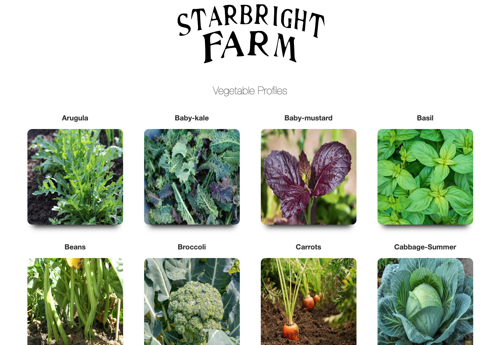

# php-veggies

## Purpose
A project that displays veggies grown by Starbright Farm. The website will display relevant crop infomation once the user clicks on the different crop profiles. 

## Built With
* HTML
* CSS
* PHP
## How to Run the Application from local host

* Pull down the application from Github
* Create a config.php in the main directory
* Inside of the config  php file insert the following code and replace user and password variables with you personal information

```
<?php

return [
    'database'=> [
        'name'=> 'veggies',
        'user'=> '<changeToUser>',
        'pass'=> '<changeToYourPassword',
        'connection'=> 'mysql:host=127.0.0.1',
        'options'=> [PDO::ATTR_ERRMODE=> PDO::ERRMODE_WARNING]
        ]
];


```

* Through MySql workbench or other interface insert the contents of the schema file within core/database/
* Then run the following command from the root of the directory 

```
php -S localhost:8888

```
## Screenshots



## Website
https://github.com/woffordlm/phpVeggies